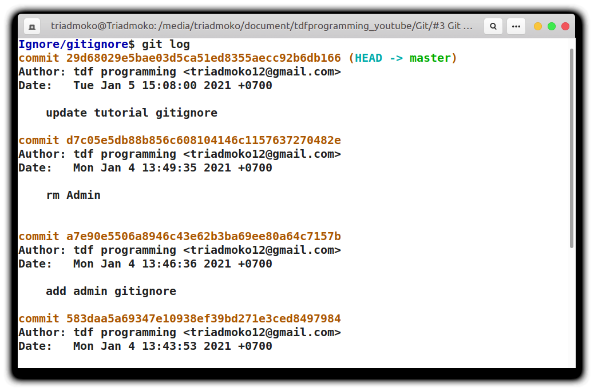
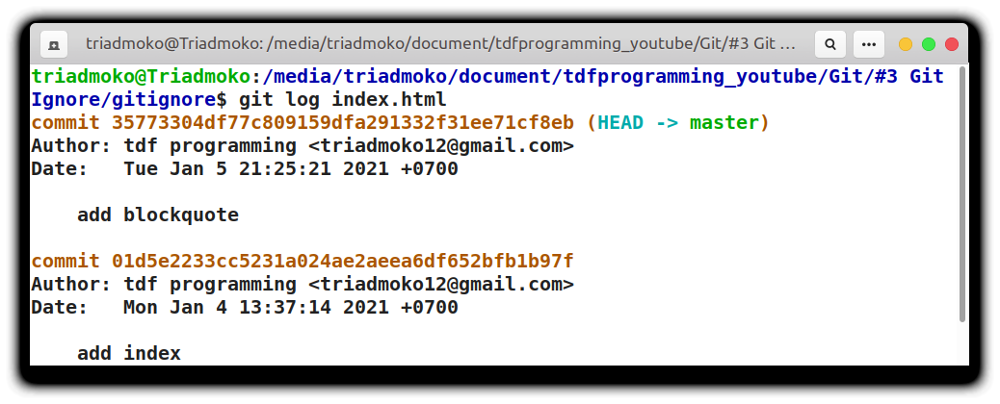
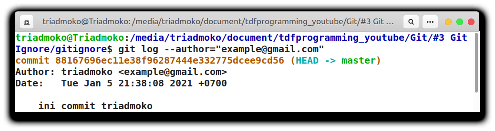

## Pengertian Gitlog
gitlog merupakan catatan history perubahan yang telah disimpan didalam database git. Setiap perubahan tersebut harus melakukan commit agar bisa dilihat menggunakan gitlog.

***

## Melihat Catatan Log
Git sudah menyediakan perintah `gitlog` untuk melihat catatan perubahan didalam working area. Anda bisa melihat catatan perubahan dengan script dibawah ini :
```console
git log
```
perintah tersebut akan menampilkan perubahan seperti berikut :

Pada gambar di atas anda melihat `commit` yang telah dilakukan oleh pengguna. Anda dapat melihat nomor revisi, nama pengguna commit, email, tanggal, jam, bahkan detik sekaligus. Jika anda menggunakan `git log` seperti ini akan menampilkan perubahan secara detail
***
## menampilkan Catatan Perubahan Singkat
Jika anda hanya menampilkan catatan perubahan tertentu, anda bisa menggunakan beberapa script menggunakan terminal.
1. ` gitlog oneline`
   <br>
    Anda dapat melihat  melihat secara singkat pesan `commit` yang telah dilakukan oleh pengguna dan nomor commitnya
   ```console
   git log --oneline
   ```
   Maka anda akan melihat tampilan seperti ini :
    
   <br><br>
2. `git log nomor commit`
   <br>
   Anda dapat menggunakan nomor commit untuk melihat catatan perubahan dengan script seperti berikut :
   ```console
    git log nomor_commit
   ```
   Maka akan tampil seperti gambar berikut : 
   
   git log dengan nomor commit oneline :
   
3. `git log dengan file tertentu`
    <br>
    Menampilkan perubahan pada file tertentu sangat penting anda gunakan, agar anda dapat melihat perubahan apa saja yang telah dilakukan oleh pengguna.
    Anda dapat menggunakan script seperti berikut :
    ```console
    git log nama_file
    ```
    Anda akan melihat seperti gambar berikut sebagai contoh :
    
    gambar diatas adalah struktur folder yang sedang digunakan. Kita akan melihat perubahan yang ada pada file `index.html`
    
    Kita akan lakukan perubahan yang ada didalam file index.html tersebut lalu kita akan cek lagi perubahannya
    
    <br><br>
4. `Menampilkan Perubahan Oleh Author `
   <br>
   Jika anda bekerja dengan tim maka hal ini sangat perlu anda ketahui. Siapa yang telah melakukan commit atau perubahan maka anda dapat mengetahuinya. Anda dapat melakukan hal tersebut seperti berikut :
   ```console
    git log --author="nama_pengguna"
   ``` 
   Anda dapat melihat seperti gambar berikut :
   
   ini merupakan perubahan yang dilakukan oleh pengguna **`tdf programming`**

   Sekarang akan kita coba untuk melakukan log yang dilakukan oleh pengguna lain menggunakan email agar lebih spesifik:
    

Anda dapat melihat tutorial berupa video melalui <a href="https://www.youtube.com/watch?v=NeC9C6xjwA4">link ini</a>  