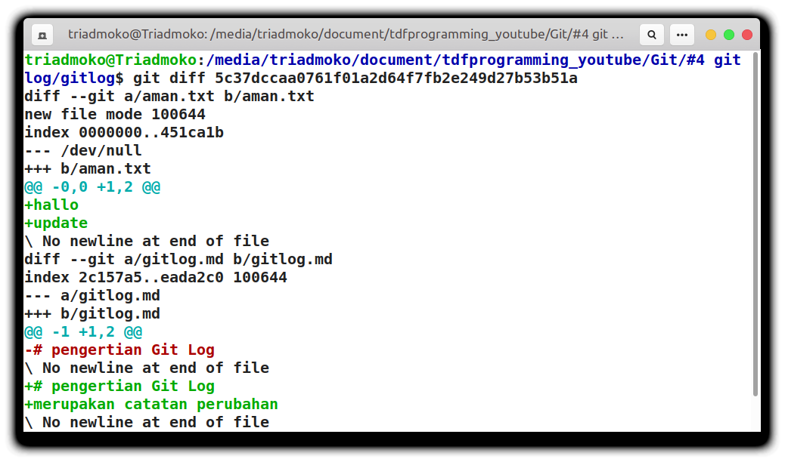

## Melihat Perbandingan dengan Git Diff
Pada tutorial sebelumnya anda sudah melihat perubahan repositori menggunakan git log. sekarang anda akan mempelajari bagaimana cara untuk melihat perbandingan perubahan yang ada pada repositori anda. <br>
Anda dapat menggunakan script dibawah ini untuk melihat perbandingan yang ada pada repositori.
```console
git dif nomor_commit
```
Pada tutorial sebelumnya anda sudah mempelajari bagaimana cara untuk melihat `nomor commit`. Jika anda lupa bagaimana cara untuk melihatnya anda bisa cek di tutorial sebelumnya. <br><br>

Jika anda menggunakan script diatas maka hasilnya akan seperti ini.



Pada gambar di atas anda melihat simbol `+` , simbol tersebut berarti anda menambahkan barisan kode. 
<br>
Jika anda melihat simbol `-` berarti anda menghapus barisan kode tersebut.

